# Pipeline Architecture

```mermaid
flowchart TB

    %% =========================================================================
    %% STAGE 1: PDF INGESTION
    %% =========================================================================
    subgraph S1["Stage 1: PDF Ingestion (main.py scrape)"]
        direction TB
        PDF[/"chapter4.pdf<br/>AML/CTF Regulation"/]
        SCRAPE["PDFScraper.scrape()<br/>Extract text nodes with<br/>rule codes, styles, bboxes"]
        PARENTS["assign_parents()<br/>Indentation-based hierarchy"]
        TOPLEVEL["assign_top_level()<br/>Top-level section grouping"]
        REFS["link_references()<br/>Cross-reference detection"]
        NODES[("nodes.json<br/>~300+ text nodes")]
        EXCERPTS[/"excerpts/<br/>Highlighted PDF crops"/]

        PDF --> SCRAPE
        SCRAPE --> PARENTS --> TOPLEVEL --> REFS --> NODES
        SCRAPE --> EXCERPTS
    end

    %% =========================================================================
    %% STAGE 2: GROUP IDENTIFICATION
    %% =========================================================================
    subgraph S2["Stage 2: Group Identification (main.py groups / enrich)"]
        direction TB
        BUILD_GROUPS["build_groups()<br/>Infer groups from rule codes<br/>+ indent clustering"]
        FILTER_SEQ["_filter_sequential_rule_codes()<br/>Remove false-positive<br/>rule code markers"]
        SVG["build_svg()<br/>Node & group visualisation"]
        ENRICH["enrich_groups_with_nodes()<br/>Attach text nodes to<br/>their parent groups"]
        GROUPS_JSON[("groups.json<br/>112 groups")]
        GROUPS_SVG[/"groups.svg"/]
        GROUPS_ENRICHED[("groups_enriched.json<br/>Groups + text nodes")]

        BUILD_GROUPS --> FILTER_SEQ --> GROUPS_JSON
        GROUPS_JSON --> SVG --> GROUPS_SVG
        GROUPS_JSON --> ENRICH --> GROUPS_ENRICHED
    end

    NODES --> BUILD_GROUPS
    NODES --> ENRICH

    %% =========================================================================
    %% STAGE 3: ARCHITECT — SECTION MODE
    %% =========================================================================
    subgraph S3["Stage 3a: Section Mode (architect.py --mode section)"]
        direction TB
        SEC_GATE["generate_section_gating_rules()<br/>Deterministic gating from<br/>introduction.json scoping"]
        SEC_BFS["Breadth-first traversal<br/>~90 groups by depth"]
        SEC_LLM["call_architect() per group<br/>Haiku (&lt;50 nodes) or<br/>Sonnet (≥50 nodes)"]
        SEC_VALIDATE["validate_ids() + strip_invalid_ids()<br/>Enforce 4_N_N... regex"]
        SEC_MERGE["Merge results into<br/>top-level section files"]
        SEC_OUT[("sections/<br/>4_1.json … 4_15.json")]

        SEC_GATE --> SEC_BFS --> SEC_LLM --> SEC_VALIDATE --> SEC_MERGE --> SEC_OUT
    end

    %% =========================================================================
    %% STAGE 3: ARCHITECT — PROCESS MODE
    %% =========================================================================
    subgraph S4["Stage 3b: Process Mode (architect.py --mode process)"]
        direction TB
        PROC_GATHER["gather_process_nodes()<br/>Collect text nodes per<br/>PROCESS_FORMS definition"]
        PROC_LLM["call_process_architect()<br/>1 LLM call per process form<br/>max_tokens=8192"]
        PROC_VALIDATE["validate_ids() + strip_invalid_ids()"]
        PROC_GATE["Inject gating rules<br/>from PROCESS_FORMS.gated_by"]
        PROC_OUT[("processes/<br/>15 JSON files<br/>cdd-individuals.json<br/>cdd-companies.json<br/>risk-assessment.json<br/>...")]

        PROC_GATHER --> PROC_LLM --> PROC_VALIDATE --> PROC_GATE --> PROC_OUT
    end

    GROUPS_ENRICHED --> SEC_BFS
    GROUPS_ENRICHED --> PROC_GATHER
    INTRO_JSON[("data/introduction.json<br/>Scoping, derived fields,<br/>button groups")] --> SEC_GATE
    INTRO_JSON --> VIEWER

    %% =========================================================================
    %% STAGE 4: COVERAGE AUDIT (deterministic)
    %% =========================================================================
    subgraph S5["Stage 4: Coverage Audit (deterministic, no LLM)"]
        direction TB
        EXTRACT_IN["extract_input_rule_codes()<br/>All rule codes from<br/>source text nodes"]
        EXTRACT_OUT["extract_output_rule_codes()<br/>All source-rules from<br/>generated controls"]
        COMPUTE["compute_coverage_report()<br/>Set diff: mapped ∩ unmapped ∩ extra"]
        LOW_CONF["Identify controls with<br/>mapping-confidence &lt; 0.5"]
        AUDIT_OUT[("_coverage_audit.json<br/>Per-process + summary")]

        EXTRACT_IN --> COMPUTE
        EXTRACT_OUT --> COMPUTE
        COMPUTE --> LOW_CONF --> AUDIT_OUT
    end

    PROC_OUT --> EXTRACT_OUT
    GROUPS_ENRICHED --> EXTRACT_IN

    %% =========================================================================
    %% STAGE 5: SECOND-PASS REVIEW (LLM)
    %% =========================================================================
    subgraph S6["Stage 5: Second-Pass Review (architect.py --review)"]
        direction TB

        subgraph REVIEW_INPUT["Review Input Assembly"]
            direction LR
            REV_ORIG["Original regulatory<br/>text nodes"]
            REV_CTRL["Generated controls with<br/>source-rules + confidence"]
            REV_UNMAPPED["Unmapped rule codes<br/>from coverage audit"]
        end

        REV_CALL["Independent Haiku LLM call<br/>per process form<br/>REVIEW_SYSTEM_PROMPT"]

        subgraph REVIEW_OUTPUT["Review Output (per control)"]
            direction TB
            QUALITY["quality rating:<br/>good | acceptable |<br/>questionable | incorrect"]
            REVIEWER_CONF["reviewer confidence<br/>0.0 – 1.0"]
            ISSUES["specific issues list"]
        end

        subgraph UNMAPPED_ASSESS["Unmapped Rule Assessment"]
            direction TB
            CORRECT_OMIT["correctly_omitted<br/>Headings, notes,<br/>non-substantive text"]
            SHOULD_MAP["should_be_mapped<br/>Substantive requirement<br/>missing a control"]
            ALREADY_COV["already_covered<br/>Substance covered but<br/>not in source-rules"]
        end

        REVIEW_INPUT --> REV_CALL
        REV_CALL --> REVIEW_OUTPUT
        REV_CALL --> UNMAPPED_ASSESS
        REVIEW_OUT[("_review_results.json")]
        REVIEW_OUTPUT --> REVIEW_OUT
        UNMAPPED_ASSESS --> REVIEW_OUT
    end

    AUDIT_OUT --> REV_UNMAPPED
    PROC_OUT --> REV_CTRL
    GROUPS_ENRICHED --> REV_ORIG

    %% =========================================================================
    %% STAGE 6: VIEWER
    %% =========================================================================
    subgraph S7["Stage 6: Viewer (viewer.html + serve.py)"]
        direction TB
        VIEWER["viewer.html<br/>Single-page compliance app"]
        INTRO_PANEL["Introduction Panel<br/>Customer type toggles<br/>+ derived fields"]
        FORM_RENDER["Form Renderer<br/>Controls, groups, rules<br/>with gating visibility"]
        STATUS["Status indicators<br/>pending | success |<br/>warning | error"]
        BADGES["Quality badges<br/>source-rules pills +<br/>confidence indicators"]
        COVERAGE_PANEL["Coverage panel<br/>Progress bar +<br/>unmapped codes"]

        VIEWER --> INTRO_PANEL
        VIEWER --> FORM_RENDER
        FORM_RENDER --> STATUS
        FORM_RENDER --> BADGES
        VIEWER --> COVERAGE_PANEL
    end

    SEC_OUT --> VIEWER
    PROC_OUT --> VIEWER

    %% =========================================================================
    %% STYLING
    %% =========================================================================
    classDef dataFile fill:#2d3748,stroke:#4a5568,color:#e2e8f0
    classDef llmCall fill:#553c9a,stroke:#6b46c1,color:#e9d8fd
    classDef deterministic fill:#234e52,stroke:#2c7a7b,color:#b2f5ea
    classDef output fill:#744210,stroke:#975a16,color:#fefcbf
    classDef viewer fill:#1a365d,stroke:#2b6cb0,color:#bee3f8

    class PDF,NODES,EXCERPTS,GROUPS_JSON,GROUPS_SVG,GROUPS_ENRICHED,INTRO_JSON dataFile
    class SEC_OUT,PROC_OUT,AUDIT_OUT,REVIEW_OUT output
    class SEC_LLM,PROC_LLM,REV_CALL llmCall
    class FILTER_SEQ,SEC_GATE,SEC_VALIDATE,PROC_VALIDATE,COMPUTE,LOW_CONF,EXTRACT_IN,EXTRACT_OUT deterministic
    class VIEWER,INTRO_PANEL,FORM_RENDER,STATUS,BADGES,COVERAGE_PANEL viewer
```

## Process Summary

| Stage | Script | Mode | LLM? | Description |
|-------|--------|------|------|-------------|
| 1 | `main.py scrape` | — | No | PDF text extraction with rule code detection, boilerplate filtering, excerpt generation |
| 2 | `main.py groups` / `enrich` | — | No | Group inference from rule codes + indent clustering, text node enrichment |
| 3a | `architect.py --mode section` | Section | Yes | Breadth-first group processing (~90 LLM calls), outputs per-regulation-section JSON |
| 3b | `architect.py --mode process` | Process | Yes | One LLM call per business process form (~15 calls), organized by process steps |
| 4 | (automatic after process mode) | — | No | Deterministic set-diff of input vs output rule codes, flags unmapped rules + low confidence |
| 5 | `architect.py --review` | Process | Yes | Independent Haiku LLM validates each mapping quality + assesses unmapped rules |
| 6 | `viewer.html` | — | No | Interactive compliance form app with gating, status tracking, confidence badges |

## Review Cycle Detail

The review cycle (Stages 4-5) provides three layers of quality assurance:

1. **LLM Self-Assessment** (Stage 3b) — Each control includes `mapping-confidence` (0.0-1.0) scored by the generating LLM
2. **Deterministic Coverage Audit** (Stage 4) — Set arithmetic comparing input rule codes against output `source-rules` to find:
   - **Unmapped codes** — regulation rules with no corresponding control
   - **Extra codes** — codes in `source-rules` not found in input (potential hallucinations)
   - **Low confidence** — controls where the generating LLM flagged uncertainty
3. **Independent LLM Review** (Stage 5) — Separate Haiku call reviews each mapping with fresh eyes:
   - Rates each control: good / acceptable / questionable / incorrect
   - Classifies each unmapped rule: correctly_omitted / should_be_mapped / already_covered
