# Pipeline Architecture

```mermaid
flowchart TB

    %% =========================================================================
    %% STAGE 1: PDF INGESTION
    %% =========================================================================
    subgraph S1["Stage 1: PDF Ingestion (main.py scrape)"]
        direction TB
        PDF[/"chapter4.pdf<br/>AML/CTF Regulation"/]
        SCRAPE["PDFScraper.scrape()<br/>Extract text nodes with<br/>rule codes, styles, bboxes"]
        PARENTS["assign_parents()<br/>Indentation-based hierarchy"]
        TOPLEVEL["assign_top_level()<br/>Top-level section grouping"]
        REFS["link_references()<br/>Cross-reference detection"]
        NODES[("nodes.json<br/>~300+ text nodes")]
        EXCERPTS[/"excerpts/<br/>Highlighted PDF crops"/]

        PDF --> SCRAPE
        SCRAPE --> PARENTS --> TOPLEVEL --> REFS --> NODES
        SCRAPE --> EXCERPTS
    end

    %% =========================================================================
    %% STAGE 2: GROUP IDENTIFICATION
    %% =========================================================================
    subgraph S2["Stage 2: Group Identification (main.py groups / enrich)"]
        direction TB
        BUILD_GROUPS["build_groups()<br/>Infer groups from rule codes<br/>+ indent clustering"]
        FILTER_SEQ["_filter_sequential_rule_codes()<br/>Remove false-positive<br/>rule code markers"]
        SVG["build_svg()<br/>Node & group visualisation"]
        ENRICH["enrich_groups_with_nodes()<br/>Attach text nodes to<br/>their parent groups"]
        GROUPS_JSON[("groups.json<br/>112 groups")]
        GROUPS_SVG[/"groups.svg"/]
        GROUPS_ENRICHED[("groups_enriched.json<br/>Groups + text nodes")]

        BUILD_GROUPS --> FILTER_SEQ --> GROUPS_JSON
        GROUPS_JSON --> SVG --> GROUPS_SVG
        GROUPS_JSON --> ENRICH --> GROUPS_ENRICHED
    end

    NODES --> BUILD_GROUPS
    NODES --> ENRICH

    %% =========================================================================
    %% STAGE 3: ARCHITECT — PROCESS MODE
    %% =========================================================================
    subgraph S3["Stage 3: Process Architect (architect.py)"]
        direction TB
        PROC_GATHER["gather_process_nodes()<br/>Collect text nodes per<br/>PROCESS_FORMS definition"]
        PROC_LLM["call_process_architect()<br/>1 LLM call per process form<br/>max_tokens=8192"]
        PROC_VALIDATE["validate_output() + strip_invalid_items()<br/>Slug group IDs · control.group refs · orphan groups"]
        PROC_INJECT["inject_static_fields()<br/>Overwrite sub_scoping + form_links<br/>with PROCESS_FORMS static values"]
        PROC_GATE["Inject gating rules<br/>from PROCESS_FORMS.gated_by"]
        PROC_OUT[("processes/<br/>15 JSON files<br/>cdd-individuals.json<br/>cdd-companies.json<br/>risk-assessment.json<br/>...")]

        PROC_GATHER --> PROC_LLM --> PROC_VALIDATE --> PROC_INJECT --> PROC_GATE --> PROC_OUT
    end

    GROUPS_ENRICHED --> PROC_GATHER
    INTRO_JSON[("data/introduction.json<br/>Scoping, derived fields,<br/>button groups")] --> VIEWER

    %% =========================================================================
    %% STAGE 4: COVERAGE AUDIT (deterministic)
    %% =========================================================================
    subgraph S4["Stage 4: Coverage Audit (deterministic, no LLM)"]
        direction TB
        EXTRACT_IN["extract_input_rule_codes()<br/>All rule codes from<br/>source text nodes"]
        EXTRACT_OUT["extract_output_rule_codes()<br/>All source-rules from<br/>generated controls"]
        COMPUTE["compute_coverage_report()<br/>Set diff: mapped ∩ unmapped ∩ extra"]
        LOW_CONF["Identify controls with<br/>mapping-confidence &lt; 0.5"]
        AUDIT_OUT[("_coverage_audit.json<br/>Per-process + summary")]

        EXTRACT_IN --> COMPUTE
        EXTRACT_OUT --> COMPUTE
        COMPUTE --> LOW_CONF --> AUDIT_OUT
    end

    PROC_OUT --> EXTRACT_OUT
    GROUPS_ENRICHED --> EXTRACT_IN

    %% =========================================================================
    %% STAGE 5: SECOND-PASS REVIEW (LLM)
    %% =========================================================================
    subgraph S5["Stage 5: Second-Pass Review (architect.py --review)"]
        direction TB

        subgraph REVIEW_INPUT["Review Input Assembly"]
            direction LR
            REV_ORIG["Original regulatory<br/>text nodes"]
            REV_CTRL["Generated controls with<br/>source-rules + confidence"]
            REV_UNMAPPED["Unmapped rule codes<br/>from coverage audit"]
        end

        REV_CALL["Independent Haiku LLM call<br/>per process form<br/>REVIEW_SYSTEM_PROMPT"]

        subgraph REVIEW_OUTPUT["Review Output (per control)"]
            direction TB
            QUALITY["quality rating:<br/>good | acceptable |<br/>questionable | incorrect"]
            REVIEWER_CONF["reviewer confidence<br/>0.0 – 1.0"]
            ISSUES["specific issues list"]
        end

        subgraph UNMAPPED_ASSESS["Unmapped Rule Assessment"]
            direction TB
            CORRECT_OMIT["correctly_omitted<br/>Headings, notes,<br/>non-substantive text"]
            SHOULD_MAP["should_be_mapped<br/>Substantive requirement<br/>missing a control"]
            ALREADY_COV["already_covered<br/>Substance covered but<br/>not in source-rules"]
        end

        REVIEW_INPUT --> REV_CALL
        REV_CALL --> REVIEW_OUTPUT
        REV_CALL --> UNMAPPED_ASSESS
        REVIEW_OUT[("_review_results.json")]
        REVIEW_OUTPUT --> REVIEW_OUT
        UNMAPPED_ASSESS --> REVIEW_OUT
    end

    AUDIT_OUT --> REV_UNMAPPED
    PROC_OUT --> REV_CTRL
    GROUPS_ENRICHED --> REV_ORIG

    %% =========================================================================
    %% STAGE 6: VIEWER
    %% =========================================================================
    subgraph S6["Stage 6: Viewer (viewer.html + serve.py)"]
        direction TB
        VIEWER["viewer.html<br/>Single-page compliance app"]
        INTRO_PANEL["Introduction Panel<br/>Customer type toggles<br/>+ derived fields"]
        SUBSCOPING["Sub-scoping Panel<br/>Per-form customer sub-type<br/>button group (e.g. Domestic / Foreign)"]
        FORM_RENDER["Form Renderer<br/>Controls in named slug groups<br/>with gating visibility"]
        STATUS["Status indicators<br/>pending | success |<br/>warning | error"]
        BADGES["Quality badges<br/>source-rules pills +<br/>confidence indicators"]
        SUBPROCESS_GRP["Subprocess Groups<br/>Visually nested with<br/>purple left border + tinted bg"]
        FORM_LINKS["Form-link Blocks<br/>Inline collapsible expansion<br/>of linked process forms"]
        COVERAGE_PANEL["Coverage panel<br/>Progress bar +<br/>unmapped codes"]

        VIEWER --> INTRO_PANEL
        VIEWER --> SUBSCOPING
        VIEWER --> FORM_RENDER
        FORM_RENDER --> STATUS
        FORM_RENDER --> BADGES
        FORM_RENDER --> SUBPROCESS_GRP
        VIEWER --> FORM_LINKS
        VIEWER --> COVERAGE_PANEL
    end

    PROC_OUT --> VIEWER

    %% =========================================================================
    %% STYLING
    %% =========================================================================
    classDef dataFile fill:#2d3748,stroke:#4a5568,color:#e2e8f0
    classDef llmCall fill:#553c9a,stroke:#6b46c1,color:#e9d8fd
    classDef deterministic fill:#234e52,stroke:#2c7a7b,color:#b2f5ea
    classDef output fill:#744210,stroke:#975a16,color:#fefcbf
    classDef viewer fill:#1a365d,stroke:#2b6cb0,color:#bee3f8

    class PDF,NODES,EXCERPTS,GROUPS_JSON,GROUPS_SVG,GROUPS_ENRICHED,INTRO_JSON dataFile
    class PROC_OUT,AUDIT_OUT,REVIEW_OUT output
    class PROC_LLM,REV_CALL llmCall
    class FILTER_SEQ,PROC_VALIDATE,COMPUTE,LOW_CONF,EXTRACT_IN,EXTRACT_OUT deterministic
    class VIEWER,INTRO_PANEL,SUBSCOPING,FORM_RENDER,STATUS,BADGES,SUBPROCESS_GRP,FORM_LINKS,COVERAGE_PANEL viewer
```



## Process Summary

| Stage | Script | LLM? | Description |
|-------|--------|------|-------------|
| 1 | `main.py scrape` | No | PDF text extraction with rule code detection, boilerplate filtering, excerpt generation |
| 2 | `main.py groups` / `enrich` | No | Group inference from rule codes + indent clustering, text node enrichment |
| 3 | `architect.py` | Yes | One LLM call per business process form (~15 calls), organised by process steps |
| 4 | (automatic after stage 3) | No | Deterministic set-diff of input vs output rule codes, flags unmapped rules + low confidence |
| 5 | `architect.py --review` | Yes | Independent Haiku LLM validates each mapping quality + assesses unmapped rules |
| 6 | `viewer.html` | No | Interactive compliance form app with gating, sub-scoping, subprocess nesting, form-links |

## Process Form Schema (Stage 3 output)

Each `processes/<form-id>.json` file produced by the architect has the following structure:

```jsonc
{
  // Controls — one per compliance obligation
  "controls": [
    {
      "id": "4_2_3_1",           // Dot-notation rule code, underscored (ID_REGEX)
      "label": "Question text",
      "detail-required": true,
      "correct-option": "Yes",   // "Yes" | "No" | "N/A"
      "source-rules": ["4.2.3"], // Regulatory rule codes this control maps to
      "mapping-confidence": 0.9, // 0.0–1.0, LLM self-assessment
      "group": "collection-kyc"  // Slug of the parent group (REQUIRED)
    }
  ],

  // Groups — semantic containers for related controls
  "groups": [
    {
      "id": "collection-kyc",    // Semantic slug (SLUG_REGEX: ^[a-z][a-z0-9-]*$)
      "title": "Collection of KYC Information",
      "variant": "main"          // "main" | "subprocess"
      // "subprocess-label": "..." // Optional label for subprocess groups
    }
  ],

  // Rules — visibility gating
  "rules": [
    {
      "target": "4_2_3_1",      // Control or group ID this rule gates
      "scope": "sub-domestic",  // Answer ID to check (intro answer or sub-type ID)
      "effect": "SHOW",         // "SHOW" | "HIDE"
      "schema": { "const": "Yes" }
    }
  ],

  // Static fields injected post-LLM by inject_static_fields()
  "sub_scoping": [              // Customer sub-type button group (from PROCESS_FORMS)
    { "id": "sub-domestic", "label": "Domestic Companies" }
  ],
  "form_links": [               // Linked sub-process forms (from PROCESS_FORMS)
    { "target": "verification-documents", "label": "Documentary Safe Harbour", "gated_by": "4_2_10" }
  ]
}
```

### Key schema rules

| Rule | Detail |
|------|--------|
| Control IDs | Must match `^4(_\d+)+(_[a-z])?$` |
| Group IDs | Must match `^[a-z][a-z0-9-]*$` (semantic slugs, never `4_x` numbers) |
| `control.group` | Must reference a slug present in the `groups` array |
| `group.variant` | `"main"` for standard groups, `"subprocess"` for optional/secondary paths |
| Scope gate questions | Never generated — forms are gated externally by the intro form |
| Sub-type gating | SHOW rules use `scope = <sub-type-id>` with `schema.const = "Yes"` |
| Form-links | Static — defined in `PROCESS_FORMS`, overwrite any LLM-generated values |

## PROCESS_FORMS Configuration

Each entry in `PROCESS_FORMS` (in `architect.py`) defines a process form with:

| Field | Type | Description |
|-------|------|-------------|
| `title` | str | Human-readable form name |
| `source_groups` | list[str] | PDF section group IDs to draw regulatory text from |
| `gated_by` | str \| None | Intro form control ID that gates this form's visibility |
| `sub_types` | list[dict] | Pre-defined customer sub-types with `id` (slug) + `label` |
| `form_links` | list[dict] | Links to other process forms; each has `target`, `label`, `gated_by` |
| `subprocess_groups` | list[str] | Slug hints for which groups should use `variant: "subprocess"` |
| `architect_notes` | list[str] | Human-in-the-loop feedback injected verbatim into the architect prompt |

### Sub-type definitions by CDD form

| Form | Sub-types |
|------|-----------|
| `cdd-individuals` | Individuals (`sub-individual`), Sole Traders (`sub-sole-trader`) |
| `cdd-companies` | Domestic (`sub-domestic`), Registered Foreign (`sub-reg-foreign`), Unregistered Foreign (`sub-unreg-foreign`) |
| `cdd-trusts` | Private Trusts (`sub-private-trust`), ASIC MIS (`sub-asic-mis`), Govt Super (`sub-govt-super`) |
| `cdd-government` | Domestic Govt Bodies (`sub-domestic-govt`), Foreign Govt Bodies (`sub-foreign-govt`) |
| Others | No sub-types (rules apply uniformly) |

### Safe harbour approach

| Form | Approach |
|------|----------|
| `cdd-individuals` | **Form-links** — links to `verification-documents` and `verification-electronic` (inline collapsible expansion, gated by `4_2_10` / `4_2_12`) |
| `cdd-companies` | **Inline subprocess groups** — `safe-harbour-listed`, `foreign-listed`, `disclosure-certificates` |
| `cdd-trusts` | **Inline subprocess groups** — `simplified-trustee-verification`, `custodians-nominees` |
| `cdd-government` | **Inline subprocess group** — `foreign-government-entities` |

## Viewer Rendering (Stage 6)

### Visibility logic (`checkVisibility`)

- If a control/group has no SHOW rules → always visible
- If it has one or more SHOW rules → visible if **any** rule is satisfied (OR semantics)
- Answers checked in order: intro form answers, then current form answers (sub-type selections)

### Group scoring (`getGroupScore`)

Groups are scored for completion based on controls where `control.group === groupId` (explicit reference, not prefix matching).

### Sub-scoping panel

Rendered above the groups when `sub_scoping` is non-empty. Selecting a sub-type sets `answers[sub.id] = "Yes"`, which flows into SHOW rule evaluation for sub-type-specific controls.

### Subprocess groups

Groups with `variant: "subprocess"` render with a 20px left indent, purple left border (`#805ad5`), and tinted background. Used for optional/secondary process paths (safe harbour, foreign company procedures, disclosure certificates).

### Form-link blocks

Rendered below the groups. Each link is a collapsible panel — on first expand, the target form JSON is fetched and its controls rendered inline using the target form's own visibility rules. Links are gated by a control in the current form (e.g., the safe harbour opt-in question).

## Review Cycle Detail

The review cycle (Stages 4-5) provides three layers of quality assurance:

1. **LLM Self-Assessment** (Stage 3) — Each control includes `mapping-confidence` (0.0-1.0) scored by the generating LLM
2. **Deterministic Coverage Audit** (Stage 4) — Set arithmetic comparing input rule codes against output `source-rules` to find:
   - **Unmapped codes** — regulation rules with no corresponding control
   - **Extra codes** — codes in `source-rules` not found in input (potential hallucinations)
   - **Low confidence** — controls where the generating LLM flagged uncertainty
3. **Independent LLM Review** (Stage 5) — Separate Haiku call reviews each mapping with fresh eyes:
   - Rates each control: good / acceptable / questionable / incorrect
   - Classifies each unmapped rule: correctly_omitted / should_be_mapped / already_covered

## Build from Scratch

```bash
# Stage 1: Scrape PDF → nodes.json + excerpts/
python main.py scrape chapter4.pdf

# Stage 2: Identify groups → groups.json + groups.svg
python main.py groups runs/1/nodes.json

# Stage 2b: Enrich groups with text nodes → groups_enriched.json
python main.py enrich runs/1/nodes.json runs/1/groups.json

# Stage 3: Generate process forms (~15 LLM calls) → processes/*.json + _coverage_audit.json
python architect.py runs/1

# Stage 5 (optional): Second-pass review → processes/_review_results.json
python architect.py runs/1 --review

# Stage 6: Serve the viewer
python serve.py
```

### Useful flags

```bash
# Dry run — print prompts without calling LLM
python architect.py runs/1 --dry-run

# Single process form only
python architect.py runs/1 --process cdd-individuals

# Override model
python architect.py runs/1 --model claude-sonnet-4-5-20250929

# Run tests
python -m pytest test_architect.py -v
```
